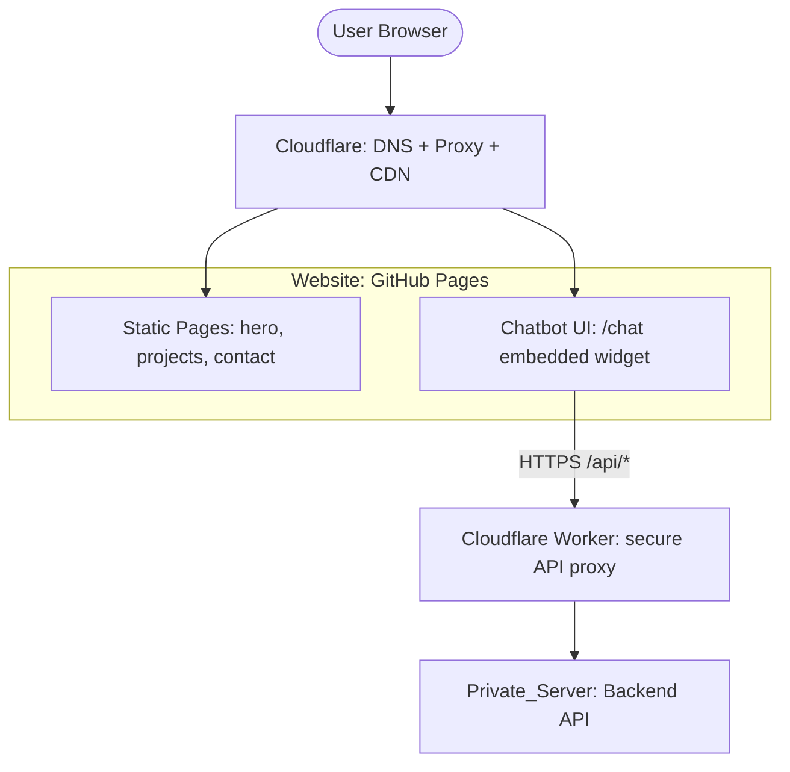
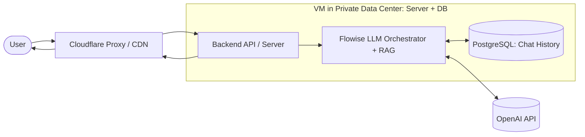

# Annie's Personal Portfolio Website

Welcome! This site showcases my working experience and my love for turning whimsical ideas into real-world products from 0 to 1.
It’s a static-first website with an embedded, LLM-powered AI chatroom. The site shows how I connect market/user research, data analysis, and lean AI prototypes before scaling to production. 

**[➡️ Visit the My Webiste: AnnieWhimsyStack.com](https://chikuku.github.io)**

---

## Project Overview
This portfolio showcases my skills and project experience for employers and collaborators. It’s an ongoing site that I update regularly with new case studies and demos. It also serves as a living lab where I explore and demonstrate applications built with the latest AI/LLM tools. I wish the work on delivered ML end to end—from product and connecting ideas can inspire people who also passionate with build applications.

## Key Features

* **Interactive AI Assistant Chatbot**: An intelligent chatbot built with Flowise and powered by the OpenAI API, capable of understanding natural language and providing relevant information.
* **Bilingual (English/Chinese) Support**: Client-side i18n (internationalization) implemented with JavaScript, allowing visitors to switch languages seamlessly.
* **Responsive Web Design (RWD)**: Ensures a consistent and optimal viewing experience across desktops, tablets, and mobile devices.
* **Secure API Key Management**: Utilizes a Cloudflare Worker as a secure proxy server to protect backend API keys from being exposed on the frontend.

**Website Overview**

**LLM AI Chatbot Data Flow**

